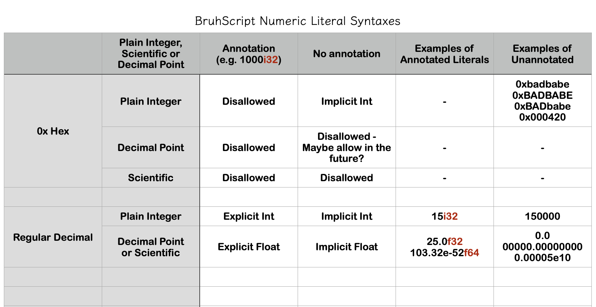

# BruhScript

## Intentions

- scripting language
- interpreted
- rust vm
- easily context switch between rust code and bruh code due to rust syntax and semantics
- embedded language, released as a crate
- extensible language
- inspired by lua
  - indexes start at 0
  - has proper dynamic array (list) and map (record) type
  - statically typed, great type inference, I hope one day
- variable declaration should seldom require type annotation
- runtime type introspection
- inspired by Wren but want integer support
  - good integer support: `u128 i128 u64 i64 u32 i32 u16 i16 u8 i8 usize isize f64 f32 bigint`
- inspired by rust
  - no lifetime, no borrow checker, no explicit referencing. GC.
  - rust style enum, struct, trait, fn, mod, impl
  - destructuring and pattern matching on let, if let, match, function parameter
  - emulates some derive macros
    - `#[derive(Debug, PartialEq, Copy, Clone, Hash, Default)]`
  - parametric polymorphism
- syntax influenced by rust, c.
  - function call = function name + parentheses
  - list items separated by commas
  - lexical scope with braces
  - implicit return
  - variable shadowing
  - semicolon: required to separate expressions
  - newline treated as whitespace
  - whitespace syntactically irrelevant
  - closure syntax tbd
  - symbol qualification like rust
    - `structure.associated_function(argument)`
    - `Structure::associated_function(argument)`
    - `path::to::module::public_function(argument)`
  - block comments can nest
  - no function overloading, no variadic
- unit-testing included - also like rust
  - `#[test]`
  - `#[should_panic]`
- functions always require type signature annotations (closure is exempted where can be inferred)
- strict typing, `struct Duck(str)` can’t be used in place for `struct Dack(str)`
- standard library implements functional programming primitives (functor applicative monad etc.)
- basically everything is expression
  - declaration, assignment and mutation expressions evaluates to unit value `()`
  - block expression evaluates to the value of its last sub-expression

### Summary

> This is an embedded scripting language for rust projects.
> Rust users should be able to context switch between bruh and rust effortlessly due to similar syntax and semantics.
> Has a higher barrier to entry due to rust-like syntax, semantics and module system.
> More ergonomic than rust due to lack of lifetime, borrow checker and explicit referencing, and easier string.
> Handy for one-pager gists, handy for large structured projects, (i.e. good module system)
> Software: write perf critical code in rust, rapidly evolving code in bruh, have the two call each other.  


## Type

- Basically stealing rust typing wholesale
- Function decls require full type signature, unless return type is ()
- `!` and `?` actual types integrated with type system
- No naked union, only enum, but enum variants first class type
- runtime type introspection reconciles with static analysis to narrow down types at compile time, much like TS.
  - this means enum variants can be narrowed down both at run and compile time
- support for literal type 

## Name

obviously, the name is not final.
maybe we can all it BrushScript, StudentUserScript, or Lub?

## Currently

- basically implementing the language with the [wren source code](*https://github.com/wren-lang/wren/blob/main/src/vm/wren_compiler.c*) (3c43de7) opened to the side of the IDE
- start with tree-walk, think about bytecode and stack/reg-vm later
- not decided on a concurrency model yet, looking at how fiber works

## Wishful thinking

- maybe target llvm-ir / c / js / ts / wasm also
- Interpret a subset of rust code....
  - take a rust source, strip away `&`, `ref`, lifetime specifier
  - add supportive library functions
  - replace unsupported macros with whatever
  - maybe runnable in some cases :/
  - is certainly not the design intention

## Numerical literal syntax



## Similarities and Differences with host language Rust

Because we're heavily influenced by rust, similarities abound

```zig
// [Type System]
// rust = (static + strong + strict + inference) + struct (impl + trait + enum)
// bruh = (static + strong + strict + inference) + struct (impl + trait + enum) 
//        + enum variant as type + introspection informs static analysis
// [Ownership and Reference]
// rust = let + let mut + & + &mut + lifetime
// bruh = let + let mut + GC
//
// [Concurrency]
// rust = async + await + static analysis (Send + Sync + Multithreading primitives)
// bruh = async + await + single thread + cooperative multitasking
//
// [Runtime]
// rust = compiled    + machine code + static free guarantees (lifetime + borrow checker)
// bruh = interpreted + bytecode vm  + gc
//
// [String]
// rust = Owned, borrowed, slice
// bruh = Behaves as if is primitive
//
// [Module and Encapsulation]
// rust = mod + use + pub(self/crate/super/in...)
// bruh = namespace (`ns`) + import (`use`) + export (`pub`) closely mirroring JS/TS 
```

## Module and Visibility 

After researching I come to the conclusion that rust module system is really the bare minimum of usability. I will steal 
it wholesale, except for the `mod.rs` part, which is basically deprecated.

## Some expectations to be met, being a "scripting language"

> Files should be plug-and-play. If you replace a file with another, and their exports look the same, 
> and the imports aren't broken, it should work. (This is emphatically not true with rust!)

I want this expectation to be met for the most part, the one exception is when the cross-file `pub(super)` feature is 
involved.

> Arbitrary entry-point
> 
> So this just means you can `node src/path/to/deep/folder/random.js` and the interpreter won't complain about the random
file not being an entry point. In most cases, the random.js is not expecting itself to be called by the interpreter directly,
and the call either does nothing, or it does something bad if the code is not careful.

I do not agree with this. I would never want files executed where they were never meant to be directly invoked.
That being said, I do appreciate flexible entry points in a scripting language.
To reconcile this, here are 2 easy rules:
- If a file has a main fn at its top level, then this file can be used as an entry point, interpreting it will 
invoke the main fn
- If otherwise, the file is a library and cannot be invoked directly. 

With this rule, you get arbitrary entry points, but only when you intend to. I believe it's a sensible, practical and
clean approach.

<i>N.B. The python community has since time immemorial figured out a solution, which is responsible for the pervasive  
unsightliness of `if __name__ == "__main__": main()`. Our above solution can be seen as exactly this, but implicitly.</i>

> Module being Singleton with top level variables

I think this is the right approach. Modules need some sort of persistence to be useful. Having top level `let` statements
is imho better than static variables. Since bruh is interpreted, top level `let`s are more expressive than rust, since 
it can call arbitrary functions.

On the issue of cyclic dependency, if two top-level `let`s are cyclically dependent, the assignment may never end. But,
this is not to be addressed by the language. 

N.B. that implementing the singleton right is not trivial, though, see 
[what they've done for JS](https://medium.com/@lazlojuly/are-node-js-modules-singletons-764ae97519af)

//////////////////////////////////////////////////////// ////////////////////////


let uuid = SEED::new() // uses 'seed';

let seed = getseed(uuid);
impl UUID {
  fn new() { seed }
}